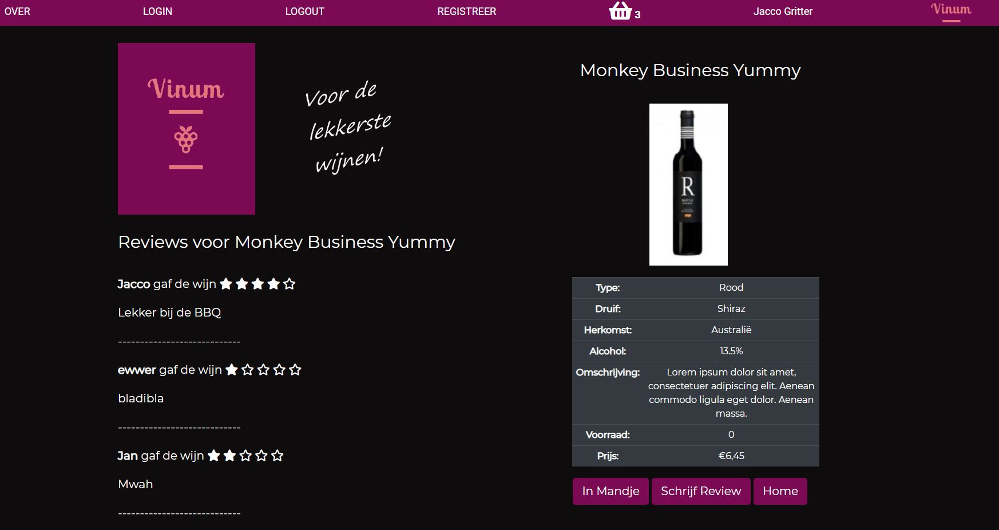

Vinum is a wines webshop.

Try it out, it is pretty much self-explanatory!

https://stormy-plains-43896.herokuapp.com/

User stories implemented:
<ul>
<li>As a shopper I want to be able to search for wines by variety so I can find the type I want</li>
<li>As a shopper I want to be able to search for wines by brand so I can find the brand I want</li>
<li>As a shopper I want to be able to search for wines by wine name so I can find the wine I want</li>
<li>As a shopper I want to be able to search for wines by country so I can find the wine I want</li>
<li>As a shopper I want to see reviews so I can make a better choice</li>
<li>As a shopper I want to be able to write reviews so I can inform other shoppers</li>
<li>As a shopper I want to be able to find company information so I know who I am dealing with</li>
<li>As a shopper I want to be able to put a wine in my shopping basket so I can buy it later</li>
<li>As a shopper I want to be able to remove a wine from my basket so I can change my mind</li>
<li>As a shopper I want to be able to see what is in my basket so I know what I have picked so far</li>
<li>As a shopper I want to see the number of items in my basket at any time so I am aware if I have something in my basket or not</li>
<li>As a shopper I want to be able to see all wines even if I am not logged in so I can decide if it is interesting to create an account or not</li>
<li>As a shopper I want to be able to log in so I can buy wines</li>
<li>As a shopper I want to be able to log out when I am done</li>
<li>As a shopper I want to be able to register so I have an account and do actual shopping</li>
<li>As a shopper I want to be able to see all relevant information about the wine</li>
<li>As a shopper I want to see what the price of a wine is so I know if I like the price</li>
<li>As a shopper I want to be able to increase/decrease the quantity of wines in my basket</li>
<li>As a shopper I want to be able to see stock information about a wine so I know if it is on stock or not</li>
</ul>

User stories still to implement
<ul>
<li>As a shopper I want to checkout and pay for my basket when I am ready so I can close the order</li>
<li>As a shopper I want to be able to select wines by price</li>
<li>As a shopper I want to see which wines I have bought before</li>
<li>As a shopper I want to be able to see previous orders</li>
</ul>

All shop owner stories still need implementation:  
As shop owner I want to be able to add/delete/update/see products in my system
.....